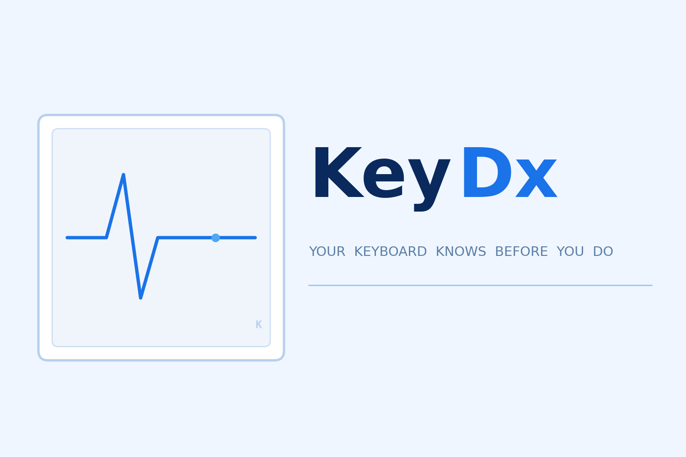

[![Contributors][contributors-shield]][contributors-url]
[![Forks][forks-shield]][forks-url]
[![Stargazers][stars-shield]][stars-url]
[![Issues][issues-shield]][issues-url]
[![MIT License][license-shield]][license-url]
[![LinkedIn][linkedin-shield]][linkedin-url]

<!-- PROJECT LOGO -->
<br />
<div align="center">
  <a href="https://github.com/venyatwi0914/ParkProj">
    
  </a>

  <h3 align="center">KeyDx</h3>

  <p align="center">
    Your keyboard knows before you do. Type to detect early Parkinson's symptoms.
  </p>
</div>

<!-- TABLE OF CONTENTS -->
<details>
  <summary>Table of Contents</summary>
  <ol>
    <li><a href="#about-the-project">About The Project</a>
      <ul>
        <li><a href="#built-with">Built With</a></li>
      </ul>
    </li>
    <li><a href="#getting-started">Getting Started</a>
      <ul>
        <li><a href="#prerequisites">Prerequisites</a></li>
        <li><a href="#installation">Installation</a></li>
      </ul>
    </li>
    <li><a href="#usage">Usage</a></li>
    <li><a href="#roadmap">Roadmap</a></li>
    <li><a href="#license">License</a></li>
    <li><a href="#contact">Contact</a></li>
    <li><a href="#acknowledgments">Acknowledgments</a></li>
  </ol>
</details>

---

<!-- ABOUT THE PROJECT -->
## About The Project

[![KeyDx Screenshot][product-screenshot]](https://github.com/YOUR_USERNAME/keydx)

After discovering the neuroQWERTY dataset, which maps typing dynamics to Parkinson's Disease (PD), we realized that a simple keyboard could serve as a non-invasive sensor for early neurological decline. KeyDx is an end-to-end clinical platform that empowers patients with early detection and provides doctors with AI-synthesized diagnostic reasoning.

**Patient Portal** — Users complete typing tasks (repetitive, standard, and natural rhythm) while the system captures raw keystroke timing. Hold time (HT) and its coefficient of variation (HT-CV = σ/μ) are extracted as the primary motor control biomarkers.

**Physician Portal** — Clinicians search for a patient by name to retrieve a full diagnostic summary integrating biometric session history, pre-loaded clinical records, and physician annotations.

**AI Diagnostic Assistant** — Powered by K2-Think-V2 (256K context window), the platform synthesizes typing data, longitudinal session trends, physician notes, and embedded research papers into a concise clinical narrative, explaining the *why* behind each risk classification.

**Specialist Finder** — When risk is elevated, doctors can instantly surface nearby licensed movement disorder neurologists via the CMS NPPES NPI Registry, with no paid API keys required.

<p align="right">(<a href="#readme-top">back to top</a>)</p>

---

### Built With

* [![Python][Python-badge]][Python-url]
* [![Flask][Flask-badge]][Flask-url]
* [![scikit-learn][sklearn-badge]][sklearn-url]
* [![Pandas][Pandas-badge]][Pandas-url]
* [![NumPy][NumPy-badge]][NumPy-url]
* [![Google Gemini][Gemini-badge]][Gemini-url]

<p align="right">(<a href="#readme-top">back to top</a>)</p>

---

<!-- GETTING STARTED -->
## Getting Started

### Prerequisites

- Python 3.10+
- pip

```sh
pip install --upgrade pip
```

### Installation

1. Clone the repo
   ```sh
   git clone https://github.com/venyatwi0914/ParkProj
   cd keydx
   ```

2. Install dependencies
   ```sh
   pip install -r requirements.txt
   ```

3. Create a `.env` file in the project root
   ```env
   # Required — AI clinical assistant (we received our key from a sponsor, but feel free to use your Gemini key here if you're unable to obtain a K2 Think V2 key)
   K2_API_KEY=your_k2thinkv2_key_here

   # Optional — enables Gemini referral narrative (free key at aistudio.google.com)
   GEMINI_API_KEY=your_gemini_key_here

   # Optional
   PORT=5000
   ```

4. Run the app
   ```sh
   python app.py
   ```

5. Open in your browser
   - Patient typing test: `http://127.0.0.1:5000/patient`
   - Physician portal: `http://localhost:5000/doctor`

> The specialist finder (CMS NPI Registry + Nominatim) requires no API keys and works out of the box.

<p align="right">(<a href="#readme-top">back to top</a>)</p>

---

<!-- USAGE -->
## Usage

### Patient Flow
A patient visits `http://127.0.0.1:5000/patient`, enters their name, and completes the typing test. KeyDx captures keystroke hold times and flight times, extracts biomarkers, and classifies PD risk as **Low**, **Medium**, or **High** using a trained Random Forest model (AUC 0.919).

### Doctor Flow
A physician visits `http://localhost:5000/doctor`, searches for a patient by name, and sees:
- All typing sessions with biomarker trends over time
- Pre-loaded clinical history and risk factors
- AI-generated diagnostic summary from K2-Think-V2
- Annotation tools (clinical / followup / concern / clear)
- Nearby licensed specialists via the NPI Registry

### Biomarker Reference

| Feature | Description | PD Signal |
|---|---|---|
| `ht_mean` | Average key hold duration (seconds) | Elevated → bradykinesia |
| `ht_cv` | Coefficient of variation of hold times | **Primary PD signal** |
| `ft_std` | Standard deviation of flight times | Elevated → motor timing deficit |
| `typing_speed` | Keys per minute | Confounded by age/experience |

**Risk thresholds (Arroyo-Gallego et al. 2017, IEEE TBME):**

| Risk | HT-CV | HT Mean | FT Std |
|---|---|---|---|
| Low | < 0.40 | < 0.15s | < 0.08s |
| Medium | 0.40 – 0.60 | 0.15 – 0.22s | — |
| High | > 0.60 | > 0.22s | > 0.12s |

> ⚠️ KeyDx is a **screening tool only** — not a diagnostic instrument. High risk warrants UPDRS assessment, DaTscan imaging, and neurology referral.

<p align="right">(<a href="#readme-top">back to top</a>)</p>

---

<!-- ROADMAP -->
## Roadmap

- [x] Random Forest classifier trained on MIT-CS1PD / CS2PD datasets (AUC 0.919)
- [x] Longitudinal patient record system with BBS-style append-only storage
- [x] K2-Think-V2 AI clinical assistant with 256K context window
- [x] Specialist finder via CMS NPI Registry (no paid API keys)
- [x] Gemini-powered referral narrative summaries
- [ ] PostgreSQL backend for dynamic patient history at scale
- [ ] Mobile / touchscreen keystroke capture for on-the-go monitoring
- [ ] Expanded study with IRB approval to validate clinical accuracy
- [ ] Multi-language support

<p align="right">(<a href="#readme-top">back to top</a>)</p>


<!-- LICENSE -->
## License

Distributed under the MIT License. See `LICENSE.txt` for more information.

<p align="right">(<a href="#readme-top">back to top</a>)</p>

---

<!-- CONTACT -->
## Contact

Venya Tiwari — venya.sarvesh@gmail.com
Angelina Wang — aangwang7@gmail.com


<p align="right">(<a href="#readme-top">back to top</a>)</p>

---

<!-- ACKNOWLEDGMENTS -->
## Acknowledgments

* Giancardo et al. (2016) — [neuroQWERTY, *Scientific Reports*](https://www.nature.com/articles/srep34468)
* Adams et al. (2017) — MIT-CS2PD longitudinal study
* Arroyo-Gallego et al. (2017) — [neuroQWERTY risk thresholds, *IEEE TBME*](https://ieeexplore.ieee.org/document/7762123)
* [CMS NPPES NPI Registry](https://npiregistry.cms.hhs.gov) — free licensed provider database
* [Nominatim / OpenStreetMap](https://nominatim.openstreetmap.org) — free geocoding
* [K2-Think-V2](https://api.k2think.ai) — high-reasoning LLM with 256K context
* [Img Shields](https://shields.io)
* [contrib.rocks](https://contrib.rocks)

<p align="right">(<a href="#readme-top">back to top</a>)</p>

---

<!-- MARKDOWN LINKS & IMAGES -->
[contributors-shield]: https://img.shields.io/github/contributors/YOUR_USERNAME/keydx.svg?style=for-the-badge
[contributors-url]: https://github.com/YOUR_USERNAME/keydx/graphs/contributors
[forks-shield]: https://img.shields.io/github/forks/YOUR_USERNAME/keydx.svg?style=for-the-badge
[forks-url]: https://github.com/YOUR_USERNAME/keydx/network/members
[stars-shield]: https://img.shields.io/github/stars/YOUR_USERNAME/keydx.svg?style=for-the-badge
[stars-url]: https://github.com/YOUR_USERNAME/keydx/stargazers
[issues-shield]: https://img.shields.io/github/issues/YOUR_USERNAME/keydx.svg?style=for-the-badge
[issues-url]: https://github.com/YOUR_USERNAME/keydx/issues
[license-shield]: https://img.shields.io/github/license/YOUR_USERNAME/keydx.svg?style=for-the-badge
[license-url]: https://github.com/YOUR_USERNAME/keydx/blob/master/LICENSE.txt
[linkedin-shield]: https://img.shields.io/badge/-LinkedIn-black.svg?style=for-the-badge&logo=linkedin&colorB=555
[linkedin-url]: https://linkedin.com/in/YOUR_LINKEDIN
[product-screenshot]: images/screenshot.png

[Python-badge]: https://img.shields.io/badge/Python-3776AB?style=for-the-badge&logo=python&logoColor=white
[Python-url]: https://python.org
[Flask-badge]: https://img.shields.io/badge/Flask-000000?style=for-the-badge&logo=flask&logoColor=white
[Flask-url]: https://flask.palletsprojects.com
[sklearn-badge]: https://img.shields.io/badge/scikit--learn-F7931E?style=for-the-badge&logo=scikit-learn&logoColor=white
[sklearn-url]: https://scikit-learn.org
[Pandas-badge]: https://img.shields.io/badge/Pandas-150458?style=for-the-badge&logo=pandas&logoColor=white
[Pandas-url]: https://pandas.pydata.org
[NumPy-badge]: https://img.shields.io/badge/NumPy-013243?style=for-the-badge&logo=numpy&logoColor=white
[NumPy-url]: https://numpy.org
[Gemini-badge]: https://img.shields.io/badge/Google%20Gemini-8E75B2?style=for-the-badge&logo=googlegemini&logoColor=white
[Gemini-url]: https://aistudio.google.com